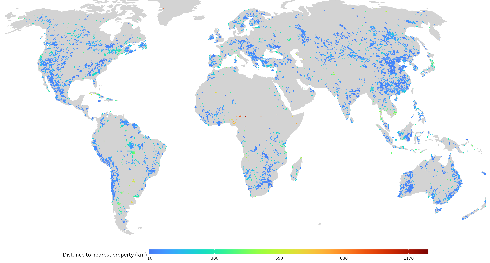

# Mining Data Gap

This repository contains the R script used to produce the figures for the commentary "Impacts for half of the world’s mining areas are undocumented" in Nature <https://doi.org/10.1038/d41586-023-04090-3>.

## Usage

The script requires three datasets. The first one includes polygons representing global mining areas. These polygons were derived from satellite images acquired in 2019 (Maus et al., 2020, 2022). The second dataset also includes information on global mining areas. It was derived from satellite images acquared over multiple years (Tang & Werner, 2023). The `main.R` script will automatically download and merge the datasets and remove polygons overlaps to achieve a more comprehensive coverage of global mining areas.

The third dataset contains the coordinates of 6,201 mining properties, extracted from the SNL Metals & Mining Dataset by S&P Global Marketplace. This dataset includes all mines that have reported production at any time between 2000 and 2019. The script expects this data in the file `./data/snl2020.gpkg`. If the data file is named differently, you can adjust this at line 35 in the `main.R` script. As this dataset is extracted from a proprietary database, it not included in the repository and must be provided by the user of the scripts.

## Output

The script conducts a calculation to determine the global share of mining areas that fall outside a 10 km buffer around the coordinates of mining properties. Mining areas situated outside this buffer cannot be readily associated with any of the 6,201 identified properties. The results are then aggregated to a grid of 50 km x 50 km cells. The map below shows the maximum distance of mining areas within each grid cell to the nearest property with production information. Only cells with at least one mining polygon farther than 10 km from the nearest property are displaed in this map.

The script also generates a binary gap map. Cells with mining area but missing data on production are marked as `1`, while all others are labeled as `0`. This map is written in GeoTIFF format to `./data/gap_grid.tif` and also saved as a PDF file at `./data/gap_grid_map.pdf`.

## References

Maus, V. and Werner, T., 2024. Impacts for half of the world’s mining areas are undocumented. Nature 625, pp.26-29.

Maus, V., Giljum, S., da Silva, D.M., Gutschlhofer, J., da Rosa, R.P., Luckeneder, S., Gass, S.L., Lieber, M., and McCallum, I., 2022. An Update on Global Mining Land Use. Scientific Data, 9(1), pp.1-11.

Maus, V., Giljum, S., Gutschlhofer, J., da Silva, D.M., Probst, M., Gass, S.L., Luckeneder, S., Lieber, M., and McCallum, I., 2020. A global-scale data set of mining areas. Scientific Data, 7(289), pp.1-13.

Tang, L., and Werner, T.T., 2023. Global Mining Footprint Mapped from High-Resolution Satellite Imagery. Communications Earth & Environment, 4(1), p.134.
